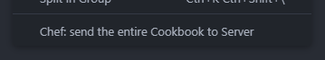

# Chef Server File Upload

The Chef Server File Upload extension is a powerful tool for developers using
Visual Studio Code. It provides an effortless way to upload `.json` files
(nodes, roles, environments, databags, policyfiles) and cookbooks to a Chef
Server, making it easier to manage your infrastructure. Whether you're a
seasoned chef or just starting out, the Chef Server File Upload extension is an
indispensable tool that will make your life easier.

*This extension only works on preconfigured chef repos.* Look for a
`.chef-repo.txt` file on your repo, and if `knife` command is working before
using this extension.

| `.json` files | Cookbooks |
|:-:|:-:|
|  |  |
